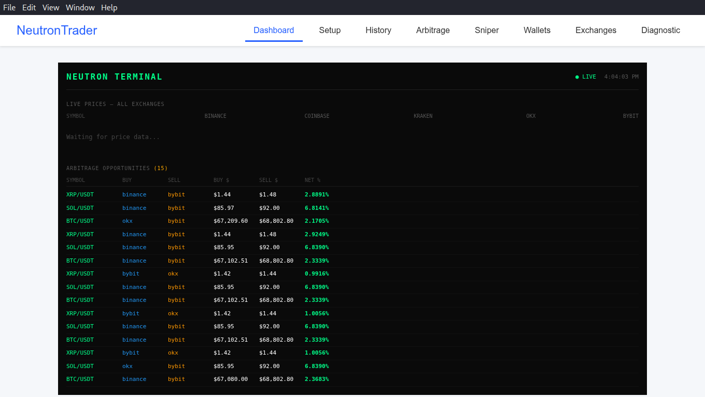
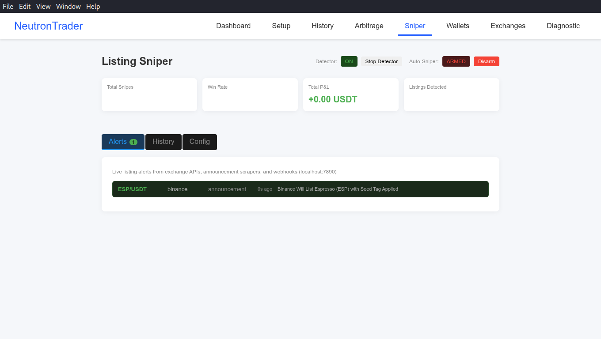
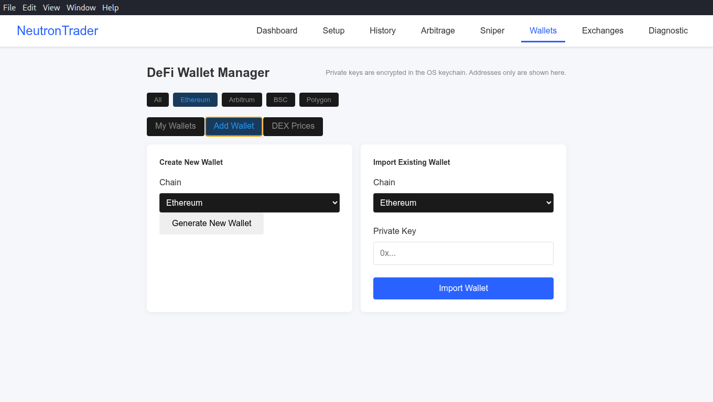

<div align="center">
  
  <h1>NeutronTrader</h1>
  <p>Multi-exchange algorithmic trading platform with arbitrage detection, listing sniper, and DeFi integration</p>

  [](https://github.com/NubleX/NeutronTrader/releases)
  [](LICENSE)
  [](CONTRIBUTING.md)
</div>

> **Alpha software.** NeutronTrader is under active development. Features work, but interfaces and APIs will change between releases. Use with testnet keys only until v1.0.

## About

NeutronTrader started as a single-exchange Binance testnet bot and has grown into a multi-exchange algorithmic trading platform. It connects to five major exchanges simultaneously, detects cross-exchange arbitrage opportunities in real time, monitors for new token listings to snipe early entries, and includes a DeFi wallet manager for on-chain swaps on Ethereum, Arbitrum, Polygon, and BSC.

Everything runs as a desktop app via Electron — no cloud dependency, no subscription, no custody of your keys.



## Features

### Multi-Exchange Price Feed
Aggregates live prices from **Binance, Coinbase, Kraken, OKX, and Bybit** simultaneously. No API keys required for market data — public endpoints only.

### Cross-Exchange Arbitrage
Detects net-profitable spreads across exchanges in real time after accounting for taker fees on both legs. Configurable minimum profit threshold. Plugs into the order manager for automated execution when keys are configured.



### Listing Sniper
Monitors exchange API symbol lists and Binance announcement feeds for new token listings. Fires alerts the moment a new symbol appears. Connects to the sniper engine to place entry orders within seconds of a listing going live.

### DeFi Wallet Manager
Create or import wallets for Ethereum, Arbitrum, Polygon, and BSC. Query on-chain balances, pool prices, and execute swaps via Uniswap V3 and PancakeSwap — all from the same desktop UI.



### Trading Strategies (Scheduled Bot)
Runs in the Electron main process on a `node-schedule` cron. Currently implemented:
- **SMA** — 5/20-period crossover signals
- **RSI** — Wilder's smoothing, configurable overbought/oversold thresholds
- **Bollinger Bands** — 2σ band breakout signals

### Security
- AES-256-GCM encrypted key vault for exchange API credentials
- Keys never leave the main process — never exposed to the renderer
- PBKDF2 key derivation (100k iterations)

### Risk Management
- Per-trade position sizing
- Daily loss circuit breaker (auto-halts trading if daily drawdown limit is hit)
- Manual circuit breaker reset from the UI

---

## Installation

### Prerequisites
- Node.js v18 or higher
- npm

```bash
git clone https://github.com/NubleX/NeutronTrader.git
cd NeutronTrader
npm install
```

## Running

```bash
# Development (Vite dev server + Electron, hot-reload)
npm run dev

# Production build (React → dist/, then package)
npm run dist
```

The dev server runs on port **5173**. On Linux, Electron needs `--no-sandbox` if running as root (Kali):

```bash
# If npm run dev opens without a window
electron --no-sandbox .
```

Built packages land in `release/`:
- `NeutronTrader-x.x.x.AppImage` — portable, runs anywhere
- `neutron-trader_x.x.x_amd64.deb` — installs via `dpkg -i`

---

## Usage

### No API keys needed to start
Price feed, arbitrage detection, and listing alerts all use public exchange endpoints. Launch the app and the live price grid is already running.

### Adding exchange credentials (for trading)
1. Open the **Exchanges** tab
2. Enter your API key and secret for each exchange you want to trade on
3. Credentials are encrypted and stored locally — never transmitted anywhere

For safe testing, use **Binance Testnet** keys from [testnet.binance.vision](https://testnet.binance.vision/).

### Arbitrage
1. Open the **Arbitrage** tab — opportunities appear automatically from the price feed
2. Set a minimum net profit % threshold
3. Enable auto-execution (requires exchange credentials for the relevant pairs)

### Listing Sniper
1. Open the **Sniper** tab
2. Start the listing detector — it polls exchange symbol lists every 30s and Binance announcements every 60s
3. Configure entry size, slippage tolerance, and which exchanges to monitor
4. Alerts fire in real time; auto-snipe executes if enabled

### DeFi
1. Open the **DeFi** tab
2. Create or import a wallet for any supported chain
3. Check on-chain balances and pool prices
4. Execute swaps via Uniswap V3 (Ethereum/Arbitrum/Polygon) or PancakeSwap (BSC)

---

## Architecture

NeutronTrader uses Electron's process isolation to keep API keys and trading logic in the main process, away from the renderer.

```
main.js                  ← Electron entry, IPC handlers, cron scheduler
electron/
  binanceApi.js          ← Legacy Binance testnet HTTP client
  priceFeedAggregator.js ← Staggered cross-exchange price polling
  riskManager.js         ← Circuit breaker, position sizing
  orderManager.js        ← Multi-exchange order routing
  websocketHandlers.js   ← WebSocket connection manager
  exchanges/             ← Adapters: Binance, Coinbase, Kraken, OKX, Bybit
  strategies/            ← ArbitrageEngine, SniperEngine
  listingDetector/       ← ExchangeApiPoller, AnnouncementScraper, WebhookReceiver
  defi/                  ← chainManager, walletManager, UniswapAdapter, PancakeSwapAdapter
  security/              ← keyVault (AES-256-GCM), encryption utils
  storageService.js      ← Persistent trade history and settings (JSON file DB)
  preload.js             ← contextBridge — exposes window.electronAPI to renderer

src/
  App.jsx                ← Root; tab navigation
  components/            ← Dashboard, TradeSetup, TradingHistory, DiagnosticTest, ...
  services/              ← binanceService.js (IPC wrapper), diagnostic utilities
```

IPC between renderer and main process uses `ipcRenderer.invoke` (request/response) and `ipcRenderer.on` (push events). The renderer never has direct access to Node.js APIs.

---

## Security Notice

**This is alpha software.** Until v1.0:
- Prefer testnet keys over real exchange credentials
- The DeFi wallet manager is experimental — do not import wallets holding significant funds
- No audit has been performed on the key vault implementation

---

## Contributing

Contributions welcome. See [CONTRIBUTING.md](CONTRIBUTING.md) and the [roadmap](ROADMAP.md) for what's planned.

---

## Acknowledgements

- [Binance](https://www.binance.com/) — Testnet API
- [Electron](https://www.electronjs.org/) — Desktop framework
- [React](https://reactjs.org/) — UI
- [ethers.js](https://ethers.org/) — EVM chain interaction
- [Recharts](https://recharts.org/) — Charts

Visit [idarti.com](https://www.idarti.com)
