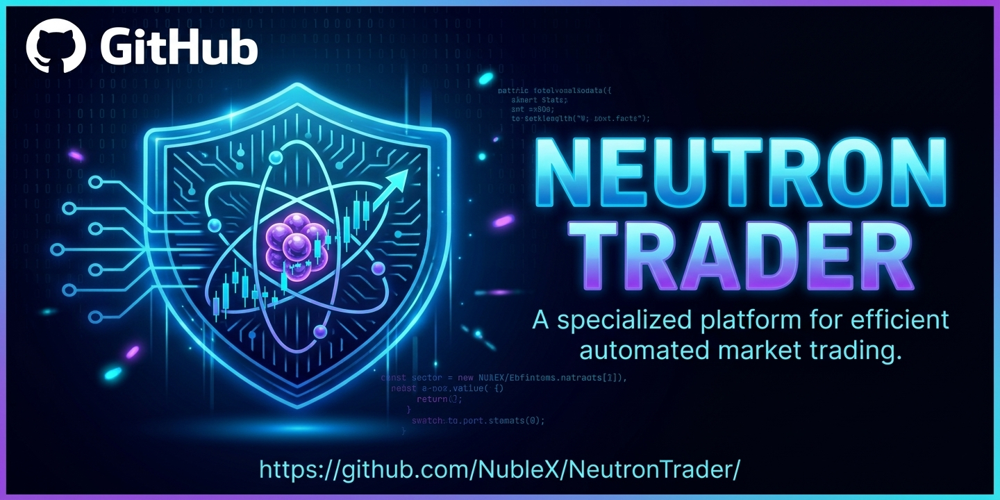
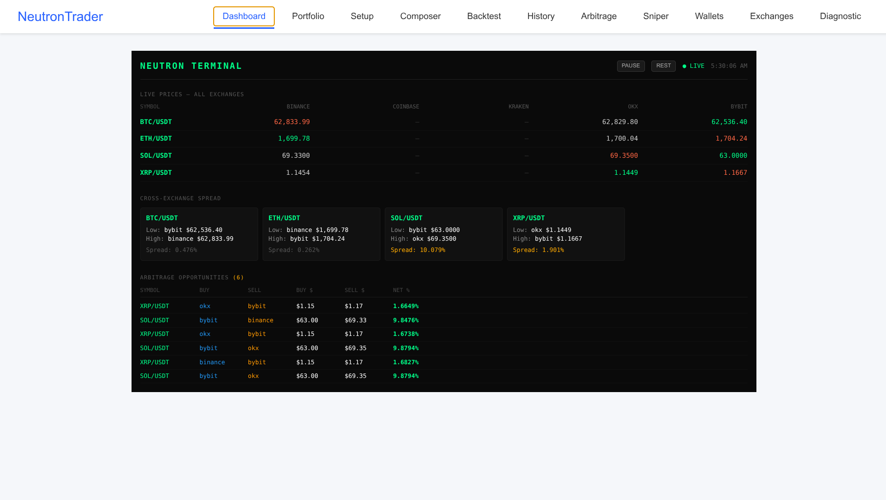
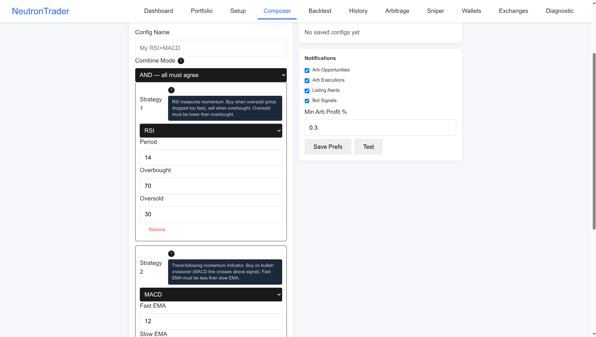

<div align="center">
  

# NeutronTrader v0.4.1


</div>

### Version: 0.4.1

**A multi-exchange algorithmic trading desktop platform with live arbitrage detection, listing sniper, strategy backtesting, and DeFi integration — built with Electron and React.**

NeutronTrader is under active development. Features work, but interfaces and APIs will change between releases. Prefer **testnet API keys** until v1.0. Mainnet market data works without keys; trading requires configured credentials.

---

## About

NeutronTrader started as a single-exchange Binance testnet bot and has grown into a cross-exchange trading platform. It connects to **Binance, Coinbase, Kraken, OKX, and Bybit** simultaneously, detects cross-exchange spreads in real time, monitors new token listings, and includes portfolio views plus optional on-chain BSC wallet reads.

Everything runs as a desktop app via Electron — no cloud dependency, no subscription, no custody of your keys.

---

## What's New in v0.4.1

- **Neutron Terminal** — live price grid, gross/net spread cards, configurable MIN NET% threshold
- **Strategy Composer** — combine RSI, SMA, Bollinger Bands, MACD with AND/OR/MAJORITY logic and validation guardrails
- **Backtesting engine** — equity curve, trade log, Sharpe, drawdown, win rate
- **Portfolio view** — aggregate CEX balances + BSC wallet (paste `0x` address)
- **WebSocket price feed** — REST/WS toggle on Dashboard (Binance/Bybit streams)
- **Persistent arbitrage history** — filter opportunities and executions with P&L attribution
- **Desktop notifications** — arb, listings, bot signals (respects Dashboard PAUSE)
- **Mainnet/Testnet toggle** — Binance mode switch on Exchanges tab
- **Sniper improvements** — multi-exchange filter, dry-run, per-listing limits

---

## Screenshots

<div align="center">

**Neutron Terminal — Live cross-exchange prices and arbitrage detection**



*Real-time prices across five exchanges, gross/net spread cards, and net-profit arbitrage opportunities.*

---

**Strategy Composer — Multi-indicator rules with guardrails**



*Combine indicators, set combine mode, fix validation errors, and configure desktop notification thresholds.*

---

**Listing Sniper — New token detection**


*Monitor exchange symbol lists and announcement feeds for new listings.*

</div>

---

## Features

**Multi-Exchange Market Data**

- Aggregates live prices from five major CEXes — public endpoints, no API keys required
- Staggered REST polling (default) or WebSocket mode for lower latency
- Cross-exchange spread cards show gross, fees, and net after taker rates

**Cross-Exchange Arbitrage**

- Detects net-profitable spreads after fees on both legs
- Configurable MIN NET% threshold on Dashboard
- Arbitrage Engine tab for auto-execution when exchange keys are configured
- Persistent history with filters (symbol, type, min profit %)

**Listing Sniper**

- Polls exchange symbol lists every 30s and Binance announcements every 60s
- Alerts fire on new listings; optional auto-snipe with dry-run mode

**Trading Strategies (Scheduled Bot)**

- SMA, RSI, Bollinger Bands, MACD — cron-scheduled in the Electron main process
- Strategy Composer for composed multi-indicator configs
- Backtest tab replays historical candles against saved configs

**Portfolio & DeFi**

- CEX balance aggregation (requires API keys)
- BSC wallet balance read via pasted EVM address
- DeFi wallet manager for Ethereum, Arbitrum, Polygon, BSC (lazy-loaded ethers.js)

**Security & Risk**

- AES-256-GCM encrypted key vault — keys never leave the main process
- Per-trade position sizing and daily loss circuit breaker
- Manual circuit breaker reset from the UI

---

## Installation

### Prerequisites

- Node.js v18 or higher
- npm

### Build from source

```bash
git clone https://github.com/NubleX/NeutronTrader.git
cd NeutronTrader
npm install
```

### Running

```bash
# Development (Vite dev server + Electron, hot-reload)
npm run dev

# Production build (React → dist/, then package)
npm run dist
```

The dev server runs on port **5173**. On Linux, Electron may need `--no-sandbox` if running as root (Kali):

```bash
electron --no-sandbox .
```

Built packages land in `release/`:

- `NeutronTrader-x.x.x.AppImage` — portable
- `neutron-trader_x.x.x_amd64.deb` — install via `dpkg -i`

---

## Usage

### No API keys needed to start

Price feed, spread detection, and listing alerts use public exchange endpoints. Launch the app and the Neutron Terminal is already running.

### Dashboard

- Live price grid across 5 exchanges
- Spread cards: gross / fees / **net** — green border when net clears MIN NET%
- **PAUSE** freezes updates and suppresses desktop notifications
- **REST / WS** toggles polling vs WebSocket streams

### Exchanges (for trading)

1. Open the **Exchanges** tab
2. Enter API key and secret per exchange
3. Use **MAINNET / TESTNET** toggle for Binance
4. Credentials are encrypted locally — never transmitted

For safe testing: [Binance Testnet](https://testnet.binance.vision/)

### Arbitrage

1. Open the **Arbitrage** tab → **Start** to enable the execution engine
2. Set min profit % and symbols in **Config** (saved across tab switches)
3. Dashboard MIN NET% controls which opportunities appear in the terminal table

> **Note:** Real CEX arb on liquid pairs is typically **negative net** after taker fees (~0.2% round-trip on Binance/OKX/Bybit). The spread cards show net explicitly so threshold settings match what you see.

### Strategy Composer & Backtest

1. **Composer** — add 2+ strategies, pick combine mode, save config
2. **Backtest** — load a saved config, pick exchange/symbol/interval, run

### Portfolio

1. **Portfolio** tab → **Connect Wallet** → paste BSC/EVM address (`0x...`)
2. View CEX balances (with keys) + on-chain BNB/BEP-20 tokens

### Listing Sniper

1. **Sniper** tab → start listing detector
2. Configure entry size, slippage, exchange filter, dry-run

---

## Architecture

NeutronTrader uses Electron process isolation — API keys and trading logic live in the main process; the React renderer communicates via IPC only.

```
main.js                  ← Electron entry, IPC handlers, cron scheduler
electron/
  priceFeedAggregator.js ← Staggered cross-exchange price polling + WS mode
  riskManager.js         ← Circuit breaker, position sizing
  orderManager.js        ← Multi-exchange order routing
  exchanges/             ← Binance, Coinbase, Kraken, OKX, Bybit adapters
  strategies/            ← ArbitrageEngine, SniperEngine, backtestEngine
  listingDetector/       ← Symbol poller, announcement scraper, webhook
  defi/                  ← chainManager, walletManager (lazy-loaded)
  security/              ← keyVault (AES-256-GCM)
  storageService.js      ← Trade history and settings (JSON file DB)
  preload.js             ← contextBridge → window.electronAPI

src/
  App.jsx                ← Tab navigation
  components/            ← Dashboard, ArbitragePanel, StrategyComposer, ...
  hooks/                 ← usePriceFeed, useWallet
  services/              ← IPC wrappers
```

---

## Security Notice

**This is alpha software.** Until v1.0:

- Prefer testnet keys over live exchange credentials
- DeFi wallet features are experimental — do not import wallets holding significant funds
- No third-party audit has been performed on the key vault implementation

Use only on systems and exchanges you are authorized to access.

---

## Contributing

Contributions welcome. See [CONTRIBUTING.md](CONTRIBUTING.md) and [ROADMAP.md](ROADMAP.md) for planned work.

---

## License

NeutronTrader is licensed under the **GNU General Public License v3.0**. See [LICENSE](LICENSE).

---

## Acknowledgements

**NeutronTrader Development Team (2025–..):**

- **Igor Dunaev / NubleX** — Lead Developer, Architecture, Project Maintainer

**Technology Stack:**

- [Electron](https://www.electronjs.org/) — Desktop framework
- [React](https://react.dev/) — UI
- [ethers.js](https://ethers.org/) — EVM chain interaction
- [Recharts](https://recharts.org/) — Charts
- Exchange public APIs — Binance, Coinbase, Kraken, OKX, Bybit

Visit [idarti.com](https://www.idarti.com)

---

*NeutronTrader — Multi-exchange algorithmic trading for the desktop.*
