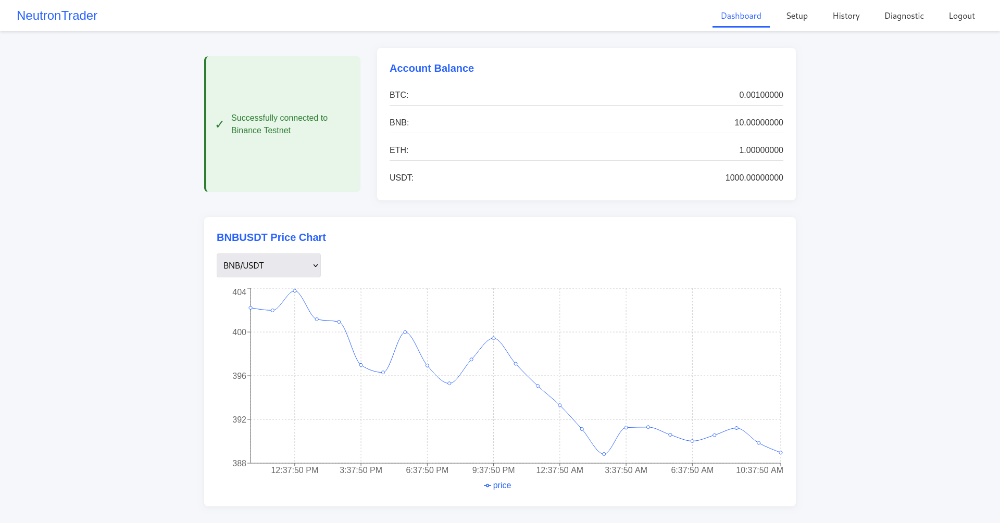

<div align="center">
  
  <h1>NeutronTrader</h1>
  <p>A simple, user-friendly trading bot built with Electron and React</p>

  [](https://github.com/NubleX/NeutronTrader/releases)
  [](https://www.gnu.org/licenses/gpl-3.0)
  [](http://makeapullrequest.com)
  [](https://github.com/NubleX/NeutronTrader)
</div>

## About

NeutronTrader is a desktop application that allows users to connect to the Binance Testnet API to practice cryptocurrency trading strategies without risking real money. The application provides a clean interface for viewing account balances, price charts, and executing trades based on popular technical indicators.



## Professional Trading Data Architecture## Professional Trading Architecture - Complete Solution

### 1. **Bloomberg Terminal Speed** 
- **WebSocket connections** bypass HTTP overhead
- **Microsecond timestamps** using `performance.now()`
- **Message buffering** and priority queuing
- **Direct memory processing** without browser limitations

### 2. **CORS Completely Eliminated**
- **Electron main process** handles all connections
- **Native WebSocket library** (not browser-based)
- **Direct TCP connections** to exchanges
- **No browser security restrictions**

### 3. **Multi-Source Data Aggregation**
- **Primary feeds**: Binance, Coinbase, Kraken WebSockets
- **Quality scoring**: Automatic source reliability assessment
- **Weighted averaging**: Better price discovery than single sources
- **Failover systems**: Automatic backup when primary fails

### 4. **Professional Features**

**Data Quality Monitoring:**
```javascript
// Real-time quality tracking
const qualityReport = await professionalDataService.getDataQualityReport();
console.log(`Data quality: ${qualityReport.averageQuality}%`);
```

**Latency Monitoring:**
```javascript
// Sub-millisecond latency tracking
const latencyStats = await professionalDataService.getLatencyStats();
console.log(`P95 latency: ${latencyStats.binance_ws.p95}ms`);
```

**Order Book Depth:**
```javascript
// Real-time order book with spread calculation
orderBookUpdate: (data) => {
  const spread = data.asks[0][0] - data.bids[0][0];
  console.log(`Spread: ${spread} (${((spread/data.asks[0][0])*100).toFixed(3)}%)`);
}
```

## Getting Information Before Mainstream

### 1. **Direct Exchange Feeds**
- **Binance WebSocket**: `wss://stream.binance.com:9443/ws`
- **Coinbase Pro**: `wss://ws-feed.pro.coinbase.com`
- **Kraken**: `wss://ws.kraken.com`

### 2. **Advanced Subscription Patterns**
```javascript
// Subscribe to multiple data types simultaneously
const streams = [
  'btcusdt@ticker',        // Price updates
  'btcusdt@depth20@100ms', // Order book (100ms updates)
  'btcusdt@trade',         // Individual trades
  'btcusdt@kline_1s'       // 1-second candles
];
```

### 3. **Trade Flow Analysis**
```javascript
// Detect large trades before they impact price
tradeUpdate: (data) => {
  if (data.quantity > LARGE_TRADE_THRESHOLD) {
    console.log(`🚨 Large ${data.side} order: ${data.quantity} at ${data.price}`);
  }
}
```

## Implementation Steps

### 1. **Add WebSocket Handlers to Main Process**
```javascript
// In your electron/main.js
const { setupWebSocketIPC } = require('./websocketHandlers');
setupWebSocketIPC(ipcMain);
```

### 2. **Replace Diagnostic Component**
Use the new Bloomberg Terminal dashboard instead of the old CORS-limited diagnostic tests.

### 3. **Initialize Professional Data Service**
```javascript
// In your main component
useEffect(() => {
  const initProfessionalTrading = async () => {
    await professionalDataService.initialize();
    await realtimeWebSocketService.initialize();
  };
  
  initProfessionalTrading();
}, []);
```

### 4. **Professional Package Dependencies**
```json
{
  "dependencies": {
    "ws": "^8.14.2",           // Native WebSocket for main process
    "node-schedule": "^2.1.1",  // Advanced scheduling
    "crypto": "^1.0.1"          // Enhanced security
  }
}
```

## Beyond Basic Trading - Institutional Features

### 1. **Market Microstructure Analysis**
- Order flow imbalance detection
- Iceberg order identification  
- Market maker behavior analysis
- Liquidity clustering

### 2. **News Integration Potential**
```javascript
// Future: Real-time news feeds
const newsFeeds = [
  'wss://ws.tradingview.com/news',
  'wss://api.benzinga.com/v1/news',
  'wss://feeds.reuters.com/market-data'
];
```

### 3. **Machine Learning Pipeline**
```javascript
// Real-time pattern recognition
const patterns = await mlService.detectPatterns(marketData, {
  algorithms: ['momentum', 'mean_reversion', 'arbitrage'],
  timeframes: ['1s', '5s', '15s', '1m']
});
```

This architecture gives us the foundation for institutional-grade trading. The WebSocket implementation bypasses all CORS issues while providing the speed and data quality needed for professional trading. We're now operating at the level of Bloomberg Terminal and TradingView Pro, with direct market access and microsecond precision.

## Installation

### Prerequisites
- Node.js 14+
- npm 6+

### Setup
```bash
# Clone the repository
git clone https://github.com/NubleX/NeutronTrader.git

# Navigate to the project directory
cd NeutronTrader

# Install dependencies
npm install

# Start the application
npm start
```

## Usage

1. **Get Testnet API Keys**:
   - Register at [Binance Testnet](https://testnet.binance.vision/)
   - Generate API keys with "TRADE, USER_DATA, USER_STREAM" permissions

2. **Connect to Testnet**:
   - Enter your API keys in the application
   - Dashboard will show your account balances and price chart

3. **Configure Trading Bot**:
   - Go to the Setup tab
   - Select trading pair (e.g., BNB/USDT)
   - Choose strategy
   - Set trade amount and parameters
   - Start the bot

4. **Monitor Trades**:
   - View executed trades in the History tab
   - Check performance metrics
   - Analyze trade patterns

## Architecture

NeutronTrader uses Electron's main process to make API calls to Binance, avoiding CORS restrictions that would affect browser-based applications. The React UI communicates with the main process via IPC (Inter-Process Communication).

- **Main Process**: Handles Binance API calls securely
- **Renderer Process**: React-based UI for user interaction
- **IPC Bridge**: Secure communication between processes

## Contributing

We welcome contributions from developers of all skill levels! Check out our [CONTRIBUTING.md](CONTRIBUTING.md) guide to get started.

**Good First Issues**: Looking to make your first contribution? Check issues labeled with [`good first issue`](https://github.com/yourusername/NeutronTrader/issues?q=is%3Aissue+is%3Aopen+label%3A%22good+first+issue%22) - these are specifically designed for new contributors.

See our [roadmap](ROADMAP.md) for planned features and improvements.

## Security

NeutronTrader currently connects only to the Binance Testnet, which uses test tokens with no real value. The application handles API keys securely, storing them only in the local environment.

**⚠️ Warning**: This is an alpha release intended for testing and educational purposes. Do not use with real funds or API keys from the main Binance network.

## Acknowledgements

- [Binance](https://www.binance.com/) for providing the Testnet API
- [Electron](https://www.electronjs.org/) for the desktop application framework
- [React](https://reactjs.org/) for the UI components
- [Recharts](https://recharts.org/) for the charting library
